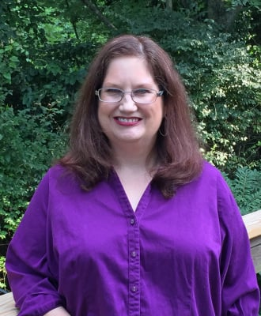

<head>
  <meta charset="UTF-8">
  <meta name="viewport" content="width=device-width, initial-scale=1.0">
  <meta http-equiv="X-UA-Compatible" content="ie=edge">
  
  
  
  <link rel="stylesheet" href="style.css">
  <title>Tynya Patton, LPC</title>
</head>
<body>
  

    

      

        <h2>About Me</h2>
      

      

        
I graduated from MTSU with a Bachelor of Arts in psychology. I attended Trevecca University for my graduate program, and received a Masters of Arts in counseling. I am a Licensed Professional
          Counselor, licensed by the
          State of Tennessee (TN 2157), with a Mental Health Service Provider designation 
              
            Before I started my private practice, I worked for 13 years doing psychiatric evaluations and psychiatric assessment in Vanderbilt Medical Center's Department of Psychiatry. While there, I trained with Steve Hollon, PhD, an
            internationally
            recognized expert in Cognitive Behavioral Therapy.
             
            I use Cognitive Behavioral Therapy, and specialize in working with clients who are experiencing depression, anxiety, grief, relationship issues, trauma, life transition, LGBT+, and those who are in alternative relationships or alternative
            lifestyles. I only treat individuals, not couples. 
             
            My passions are counseling and pets. My dog, Navi, will be present for your sessions. He is a bit camera- shy, so you may not see him, but you may hear his gentle snoring, or his not-so-gentle "YIP!," as he dreams. Be prepared for me to
            ask
            you about any pets you have. 
             
            If you’re struggling right now I really encourage you to reach out. We can do it together. We’ll work together to empower you with the tools you need to challenge what isn’t working, and start building a more satisfying life. 
             
            I'm currently accepting new clients. I look forward to meeting you!
        

        <button id="aboutMeReadMore" class="readMore">Read More...</button>
      

      

    

  

</body>
